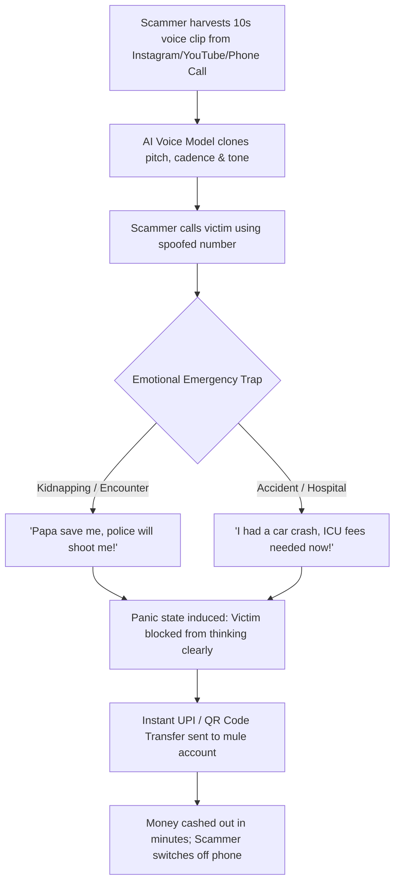
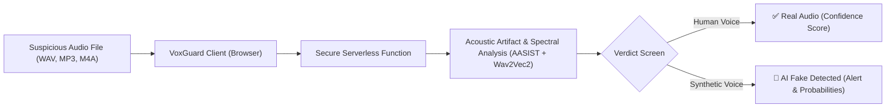

# 🚨 Real-World AI Voice Impersonation Scams in India (2023–2026)

> **A Layman-Friendly Investigation & Documentation of AI Voice-Cloning Fraud in India with Authenticated News Proof**  
> *Prepared for public awareness and technical defense research by the [VoxGuard](https://voxguard.pages.dev) initiative.*

---

## 📖 Table of Contents
1. [What is AI Voice Cloning? (In Plain Words)](#-what-is-ai-voice-cloning-in-plain-words)
2. [Why Are People Falling For It? The Psychological Trap](#-why-are-people-falling-for-it-the-psychological-trap)
3. [Summary of Documented Cases & Money Stolen](#-summary-of-documented-cases--money-stolen)
4. [Detailed Case Files (With Authenticated News Links)](#-detailed-case-files)
   - [Case 1: June 2026 – Mumbai Corporate MD Impersonation (₹10 Crore)](#case-1-june-2026--mumbai-corporate-md-impersonation-10-crore)
   - [Case 2: August 2026 – Multi-Character Matrimonial Scam (₹11.8 Lakh)](#case-2-august-2026--multi-character-matrimonial-scam-118-lakh)
   - [Case 3: January 2026 – Indore Play-School Teacher Emergency (₹97,500)](#case-3-january-2026--indore-play-school-teacher-emergency-97500)
   - [Case 4: August 2026 – Kolkata Senior Citizen Hospital Scam (₹95,990)](#case-4-august-2026--kolkata-senior-citizen-hospital-scam-95990)
   - [Case 5: March 2024 – Indore Father & The Fake "Police Encounter" (₹1.5 Lakh)](#case-5-march-2024--indore-father--the-fake-police-encounter-15-lakh)
   - [Case 6: April 2024 – Mumbai Businessman & The Dubai Embassy Call (₹80,000)](#case-6-april-2024--mumbai-businessman--the-dubai-embassy-call-80000)
   - [Case 7: January 2024 – Lucknow Hospital Bill Medical Scam (₹32,000)](#case-7-january-2024--lucknow-hospital-bill-medical-scam-32000)
   - [Case 8: December 2023 – Delhi Kidnapping Extortion (₹50,000)](#case-8-december-2023--delhi-kidnapping-extortion-50000)
   - [Case 9: December 2023 – Lucknow Distant Uncle UPI Scam (₹44,500)](#case-9-december-2023--lucknow-distant-uncle-upi-scam-44500)
   - [Case 10: November 2023 – Hyderabad Canada Nephew Accident (₹1.4 Lakh)](#case-10-november-2023--hyderabad-canada-nephew-accident-14-lakh)
   - [Case 11: July 2023 – Kozhikode Deepfake Video & Voice Call (₹40,000)](#case-11-july-2023--kozhikode-deepfake-video--voice-call-40000)
5. [Visual Workflow: How the Attack Unfolds](#-visual-workflow-how-the-attack-unfolds)
6. [Citizen Defense: How to Protect Yourself & Your Family](#-citizen-defense-how-to-protect-yourself--your-family)
7. [How VoxGuard Protects You](#-how-voxguard-protects-you)

---

## 🎙️ What is AI Voice Cloning? (In Plain Words)

Imagine someone calling your phone. The voice on the other end sounds **identical** to your son, daughter, brother, or boss. They speak with the same accent, tone, breathing pauses, and emotional nuances. They tell you they are in immediate, life-threatening danger and beg you to transfer money right away.

**It isn't them. It is an Artificial Intelligence program pretending to be them.**

### How do scammers do this?
1. **Stealing Audio:** Scammers collect just **3 to 15 seconds** of your target relative's voice from public Instagram Reels, YouTube videos, LinkedIn webinars, Facebook stories, or even a casual "wrong number" phone call.
2. **Cloning the Vocal Blueprint:** Modern generative AI audio models (like Tortoise, XTTS, or proprietary APIs) analyze that sample and learn the person's unique vocal cords, pitch, inflection, and cadence.
3. **Typing or Speaking Lies:** The fraudster types text or speaks into a microphone, and the AI transforms their speech into the victim relative's voice in real-time.

---

## 🧠 Why Are People Falling For It? The Psychological Trap

Scammers do not just use technology; they exploit **human emotion**:
* **⚡ Manufactured Panic:** The callers scream, sob, or whisper in terrified tones ("*Papa please save me! The police have me!*"). When adrenaline spikes, rational critical thinking drops.
* **🤫 Strict Secrecy:** Scammers demand that the victim stay on the line and tell no one ("*If you hang up or tell anyone, we will shoot him!*"). This prevents the victim from simply calling the relative to verify.
* **⚡ Instant Digital Payments:** Scammers push for instant UPI, Paytm, or Google Pay transfers to disposable mule accounts that are cashed out within minutes.

---

## 📊 Summary of Documented Cases & Money Stolen

Below is a verified record of Indian fraud incidents where police investigations or forensic cyber experts explicitly confirmed the deployment of AI voice-cloning or deepfake voice tools, accompanied by specific documented losses.

| Date | Location | Victim Profile | Impersonation Persona | Documented Loss | Primary Media Source |
| :--- | :--- | :--- | :--- | :--- | :--- |
| **June 2026** | Mumbai / Delhi | Firm's Dy. General Manager | Company Managing Director | **₹10,00,00,000** (₹10 Cr) | [India Today](https://www.indiatoday.in/cities/delhi/story/ai-voice-cloning-fraud-delhi-police-arrest-five-rs-10-crore-mumbai-company-scam-2928485-2026-06-17) |
| **August 2026** | Maharashtra | Prospective Groom & Father | Female Doctor & Relatives (Multi-Voice) | **₹11,80,000** (₹11.8 Lakh) | [Economic Times EnterpriseAI](https://enterpriseai.economictimes.indiatimes.com/news/industry/ai-voice-cloning-used-in-matrimonial-scam-man-arrested-for-11-8-lakh-fraud/133535162) |
| **January 2026** | Indore, MP | 43yo Play-School Teacher | Cousin (UP Police Sub-Inspector) | **₹97,500** | [The New Indian Express](https://www.newindianexpress.com/india/2026/Jan/09/madhya-pradeshs-first-ai-voice-cloning-fraud-reported-in-indore-play-school-head-loses-entire-savings) |
| **August 2026** | Kolkata, WB | 67yo Senior Citizen | Close Acquaintance "Ajoy" | **₹95,990** | [Times of India](https://timesofindia.indiatimes.com/city/kolkata/man-loses-rs-95k-to-ai-voice-scam/articleshow/133331043.cms) |
| **March 2024** | Indore, MP | Anxious Father | Son Studying in Kota Coaching | **₹1,50,000** (₹1.5 Lakh) | [Times of India](https://timesofindia.indiatimes.com/city/indore/ai-voice-clone-new-tool-of-cybercrime/articleshow/108280568.cms) |
| **April 2024** | Mumbai, MH | 68yo Businessman | Son Detained in Dubai | **₹80,000** | [Times of India](https://timesofindia.indiatimes.com/city/mumbai/ai-voice-clone-used-to-cheat-mumbai-businessman-of-rs-80000/articleshow/109233385.cms) |
| **Jan 2024** | Lucknow, UP | Resident Woman | Brother-in-law (Dharmendra) | **₹32,000** | [The Tribune India](https://www.tribuneindia.com/news/uttar-pradesh/up-woman-duped-through-ai-voice-cloning-told-to-clear-hospital-bills-583901) |
| **Dec 2023** | Delhi (Yamuna Vihar) | 62yo Lakshmi Chand Chawla | Cousin's 25yo Son | **₹50,000** | [NDTV](https://www.ndtv.com/delhi-news/elderly-delhi-man-duped-by-ai-cloned-voice-loses-rs-50-000-in-extortion-4658383) |
| **Dec 2023** | Lucknow, UP | 25yo Kartikeya | Maternal Uncle | **₹44,500** | [Times of India](https://timesofindia.indiatimes.com/city/lucknow/in-1st-voice-fraud-case-man-duped-of-44500/articleshow/106074579.cms) |
| **Nov 2023** | Hyderabad, TS | 59yo Woman | Nephew in Canada | **₹1,40,000** (₹1.4 Lakh) | [IndiaAI National Portal](https://indiaai.gov.in/news/a-woman-from-hyderabad-loses-1-4-lakh-rupees-in-an-ai-scam) |
| **July 2023** | Kozhikode, KL | Retired Coal India Officer | Former Senior Colleague | **₹40,000** | [Hindustan Times](https://www.hindustantimes.com/india-news/deepfake-scammers-trick-indian-man-into-transferring-money-police-investigating-multi-million-rupee-scam-101689622291654.html) |
| **TOTAL** | — | — | — | **₹10,17,29,990** *(> ₹10.17 Crore)* | *11 Documented Cases* |

---

## 📁 Detailed Case Files

---

### Case 1: June 2026 – Mumbai Corporate MD Impersonation (₹10 Crore)

* **📍 Location:** Mumbai, Maharashtra & New Delhi
* **💸 Financial Loss:** **₹10,00,00,000 (₹10 Crore)**
* **🎭 The Story:**
  A sophisticated syndicate cloned the voice of the Managing Director of an established Mumbai-based firm. The scammers phoned the company’s Deputy General Manager (DGM). Using the MD's authoritative cadence, vocal inflections, and specific corporate vernacular, the impersonator instructed the DGM to execute emergency transfers for a confidential high-priority business transaction. Believing he was following his CEO's direct verbal commands, the executive disbursed ₹10 crore across 63 distinct bank accounts.
* **🚩 The Red Flag:** High-value corporate disbursements authorized solely over an unverified voice phone call without dual-key cryptographic confirmation or in-person verification.
* **🔗 Authenticated News Proof:**
  - [India Today: AI voice cloning fraud: Delhi Police arrest five in Rs 10-crore Mumbai company scam](https://www.indiatoday.in/cities/delhi/story/ai-voice-cloning-fraud-delhi-police-arrest-five-rs-10-crore-mumbai-company-scam-2928485-2026-06-17)

---

### Case 2: August 2026 – Multi-Character Matrimonial Scam (₹11.8 Lakh)

* **📍 Location:** Maharashtra
* **💸 Financial Loss:** **₹11,80,000 (₹11.8 Lakh)**
* **🎭 The Story:**
  A 26-year-old cybercriminal created an elaborate fake matrimonial profile posing as an eligible female doctor. When the prospective groom and his father initiated contact, the scammer utilized real-time AI voice-cloning software to simulate **multiple characters**: the female bride-to-be, her elderly uncle, and her brothers. By switching between cloned feminine and masculine voices, the scammer convinced the family that they were speaking to an entire respectable household, eventually duping them of ₹11.8 lakh under the pretext of pre-wedding emergencies.
* **🚩 The Red Flag:** Engaging in extensive financial transactions with an online acquaintance without an in-person meeting or live verified video authentication.
* **🔗 Authenticated News Proof:**
  - [The Economic Times EnterpriseAI: AI voice cloning used in matrimonial scam; man arrested for 11.8 lakh fraud](https://enterpriseai.economictimes.indiatimes.com/news/industry/ai-voice-cloning-used-in-matrimonial-scam-man-arrested-for-11-8-lakh-fraud/133535162)

---

### Case 3: January 2026 – Indore Play-School Teacher Emergency (₹97,500)

* **📍 Location:** Indore (Lasudia), Madhya Pradesh
* **💸 Financial Loss:** **₹97,500** (Entire life savings emptied)
* **🎭 The Story:**
  A 43-year-old play-school teacher received a call late at night from an unknown number. The caller sounded identical to her cousin, an officer in the Uttar Pradesh Police. The voice sounded panicked and breathless, explaining that a close friend had suffered a massive heart attack in Indore and required immediate bypass surgery. Claiming his UP banking app was failing, the caller sent a QR code to transfer hospital fees. The victim and her daughter made four consecutive payments before learning the cousin had never called.
* **🚩 The Red Flag:** Receiving an urgent distress call from a relative using an unfamiliar number, with urgent demands to scan third-party QR codes.
* **🔗 Authenticated News Proof:**
  - [The New Indian Express: Madhya Pradesh's first AI voice cloning fraud reported in Indore](https://www.newindianexpress.com/india/2026/Jan/09/madhya-pradeshs-first-ai-voice-cloning-fraud-reported-in-indore-play-school-head-loses-entire-savings)
  - [Free Press Journal: Indore cyber crime: 43-year-old teacher falls victim to AI voice cloning, loses 97k](https://www.freepressjournal.in/indore/indore-cyber-crime-43-year-old-school-teacher-falls-victim-to-ai-voice-cloning-loses-97k)

---

### Case 4: August 2026 – Kolkata Senior Citizen Hospital Scam (₹95,990)

* **📍 Location:** Beleghata, Kolkata, West Bengal
* **💸 Financial Loss:** **₹95,990**
* **🎭 The Story:**
  A 67-year-old senior citizen received a sudden call from someone sounding exactly like his longtime acquaintance "Ajoy". The impersonator claimed that a close family member had met with a grave accident and was admitted to an ICU, needing instant cash deposits to initiate surgery. Feeling compassionate and trusting the familiar voice, the pensioner completed multiple online transactions in under 45 minutes, totaling ₹95,990.
* **🚩 The Red Flag:** High emotional pressure and refusal to let the victim call the hospital directly.
* **🔗 Authenticated News Proof:**
  - [Times of India: Man loses Rs 95k to AI voice scam in Kolkata](https://timesofindia.indiatimes.com/city/kolkata/man-loses-rs-95k-to-ai-voice-scam/articleshow/133331043.cms)
  - [The Daily Pioneer: When your voice is no longer proof](https://dailypioneer.com/news/when-your-voice-is-no-longer-proof)

---

### Case 5: March 2024 – Indore Father & The Fake "Police Encounter" (₹1.5 Lakh)

* **📍 Location:** Indore, Madhya Pradesh
* **💸 Financial Loss:** **₹1,50,000 (₹1.5 Lakh)**
* **🎭 The Story:**
  A terrified father in Indore received a call from an aggressive man posing as a senior police officer. The caller claimed the man’s teenage son (who was studying at an IIT-JEE coaching institute in Kota) had been apprehended in a gang rape case. The scammer then put the "son" on the phone—the AI clone was sobbing uncontrollably, screaming *"Papa, please save me, they will encounter me!"* Distraught and unable to reach his son on his switched-off mobile, the father wired ₹1.5 lakh within minutes.
* **🚩 The Red Flag:** Claims of "police custody" demanding cash bribes via UPI, coupled with threats of immediate violence or fake encounters.
* **🔗 Authenticated News Proof:**
  - [Times of India: AI voice clone new tool of cybercrime in Indore](https://timesofindia.indiatimes.com/city/indore/ai-voice-clone-new-tool-of-cybercrime/articleshow/108280568.cms)

---

### Case 6: April 2024 – Mumbai Businessman & The Dubai Embassy Call (₹80,000)

* **📍 Location:** Powai, Mumbai, Maharashtra
* **💸 Financial Loss:** **₹80,000**
* **🎭 The Story:**
  A 68-year-old businessman received an urgent call purporting to be from an official at the Indian Embassy in Dubai. The caller claimed the businessman's son had been arrested in Dubai and faced potential life imprisonment. To make the call undeniable, the fraudsters played an AI-generated audio clip of his son crying, begging his father to pay legal clearance fees immediately. The panicked father instructed his accountant to wire ₹80,000 via Google Pay before discovering his son was safe at home in Dubai.
* **🚩 The Red Flag:** Government or embassy officials demanding personal payments through consumer UPI apps like Google Pay or PhonePe.
* **🔗 Authenticated News Proof:**
  - [Times of India: AI voice clone used to cheat Mumbai businessman of Rs 80,000](https://timesofindia.indiatimes.com/city/mumbai/ai-voice-clone-used-to-cheat-mumbai-businessman-of-rs-80000/articleshow/109233385.cms)

---

### Case 7: January 2024 – Lucknow Hospital Bill Medical Scam (₹32,000)

* **📍 Location:** Subhash Nagar, Lucknow, Uttar Pradesh
* **💸 Financial Loss:** **₹32,000**
* **🎭 The Story:**
  Rajlakshmi Dohre received a call from a scammer using an AI clone of her brother-in-law Dharmendra. The voice claimed his daughter was in critical condition in the hospital and his own UPI payments were failing due to daily bank limits. Panicked for her niece's safety, the woman immediately cleared the ₹32,000 hospital payment via UPI.
* **🚩 The Red Flag:** The classic "my UPI is failing, please send it from your account right now" pretext.
* **🔗 Authenticated News Proof:**
  - [The Tribune India: UP woman duped through AI voice cloning, told to clear hospital bills](https://www.tribuneindia.com/news/uttar-pradesh/up-woman-duped-through-ai-voice-cloning-told-to-clear-hospital-bills-583901)

---

### Case 8: December 2023 – Delhi Kidnapping Extortion (₹50,000)

* **📍 Location:** Yamuna Vihar, North-East Delhi
* **💸 Financial Loss:** **₹50,000**
* **🎭 The Story:**
  62-year-old senior citizen Lakshmi Chand Chawla received a WhatsApp voice call from extortionists claiming they had kidnapped his cousin's 25-year-old son. The criminals played a realistic, emotionally harrowing AI-cloned recording of the young man crying and begging for his life. Panicked that the boy would be murdered, the senior citizen transferred ₹50,000 via Paytm before confirming that the child was safe at home.
* **🚩 The Red Flag:** WhatsApp voice notes from unknown international or VoIP numbers demanding instant ransoms.
* **🔗 Authenticated News Proof:**
  - [NDTV: Elderly Delhi man duped by AI-cloned voice, loses Rs 50,000 in extortion](https://www.ndtv.com/delhi-news/elderly-delhi-man-duped-by-ai-cloned-voice-loses-rs-50-000-in-extortion-4658383)
  - [The Hindu: Fraudsters dupe man of ₹50k by faking nephew's abduction in north-east Delhi](https://www.thehindu.com/news/cities/Delhi/fraudsters-dupe-man-of-50k-by-faking-nephews-abduction-in-north-east-delhi/article67632218.ece)

---

### Case 9: December 2023 – Lucknow Distant Uncle UPI Scam (₹44,500)

* **📍 Location:** Vineet Khand (Gomti Nagar), Lucknow, Uttar Pradesh
* **💸 Financial Loss:** **₹44,500** (Attempted ₹90,000)
* **🎭 The Story:**
  25-year-old Kartikeya received a call mimicking his distant maternal uncle. The caller asked him to urgently forward ₹90,000 to an associate and sent spoofed bank SMS messages making it appear that ₹90,000 had just been credited to Kartikeya's account. Believing the voice was his uncle and the fake SMS was genuine, Kartikeya initiated transfers, losing ₹44,500 before subsequent attempts failed due to bank server timeouts.
* **🚩 The Red Flag:** Trusting SMS balance alerts without opening your actual mobile banking app to inspect your real cleared ledger balance.
* **🔗 Authenticated News Proof:**
  - [Times of India: In 1st voice fraud case, Lucknow man duped of Rs 44,500](https://timesofindia.indiatimes.com/city/lucknow/in-1st-voice-fraud-case-man-duped-of-44500/articleshow/106074579.cms)
  - [Hindustan Times Tech: Man defrauded in AI voice scam; know how to stay safe from fakes](https://tech.hindustantimes.com/how-to/man-defrauded-of-45000-in-ai-voice-scam-know-how-to-stay-safe-from-fakes-71702969936547.html)

---

### Case 10: November 2023 – Hyderabad Canada Nephew Accident (₹1.4 Lakh)

* **📍 Location:** Hyderabad, Telangana
* **💸 Financial Loss:** **₹1,40,000 (₹1.4 Lakh)**
* **🎭 The Story:**
  A 59-year-old woman in Hyderabad received a late-night phone call from an unknown Canadian number. The speaker spoke in her family's specific regional Punjabi dialect and sounded identical to her nephew living in Canada. The caller claimed he had been involved in a serious motor vehicle crash, was facing immediate arrest by Canadian authorities, and needed ₹1.4 lakh wired to a lawyer's account immediately. Under immense emotional distress, she complied before realizing it was an AI synthesis.
* **🚩 The Red Flag:** The scammer repeatedly demanded absolute secrecy and insisted she must not inform other family members.
* **🔗 Authenticated News Proof:**
  - [IndiaAI (National AI Portal of India): A woman from Hyderabad loses 1.4 lakh rupees in an AI scam](https://indiaai.gov.in/news/a-woman-from-hyderabad-loses-1-4-lakh-rupees-in-an-ai-scam)
  - [Financial Express: Woman falls prey to AI voice scam, loses Rs 1.4 lakh by mistaking caller for nephew](https://www.financialexpress.com/life/technology-woman-falls-prey-to-ai-voice-scam-loses-rs-1-4-lakh-by-mistaking-caller-for-nephew-3311768/)

---

### Case 11: July 2023 – Kozhikode Deepfake Video & Voice Call (₹40,000)

* **📍 Location:** Kozhikode, Kerala
* **💸 Financial Loss:** **₹40,000** *(Promptly frozen and recovered by Kozhikode Cyber Police)*
* **🎭 The Story:**
  P.S. Radhakrishnan, a retired Coal India executive, received a WhatsApp video call. On screen was the face and voice of his former senior colleague from Andhra Pradesh. The simulated person pleaded for ₹40,000 for emergency medical treatment for his sister. Radhakrishnan transferred the funds via Google Pay. Only when the caller called back demanding an additional ₹35,000 did he become suspicious and call his friend directly.
* **🚩 The Red Flag:** Glitches, unnatural blinking, robotic lip-sync cadence, and immediate requests for emergency cash.
* **🔗 Authenticated News Proof:**
  - [Hindustan Times: Deepfake scammers trick Indian man into transferring money in pioneering cyber case](https://www.hindustantimes.com/india-news/deepfake-scammers-trick-indian-man-into-transferring-money-police-investigating-multi-million-rupee-scam-101689622291654.html)

---

## 🔄 Visual Workflow: How the Attack Unfolds

---

## 🛡️ Citizen Defense: How to Protect Yourself & Your Family

If you or a loved one receive a distress call demanding money, follow the **4 Golden Rules of Audio Defense**:

### 1. The 5-Minute Callback Rule ⏱️
* **NEVER send money on the incoming call.**
* Tell the caller: *"My connection is breaking, I will call you back in two minutes."*
* Immediately hang up and dial the relative on their **known, saved personal phone number** or message them on their personal WhatsApp. 99% of voice scams disintegrate at this step.

### 2. Set Up a "Family Safe Word" 🔑
* Agree upon a private family code word (e.g., *"BlueMango"* or the name of your childhood pet) with your children, parents, and close relatives.
* If anyone calls claiming an emergency, ask: *"What is our family code word?"* An AI cannot guess it.

### 3. Ask a Hyper-Specific Personal Question ❓
* Ask a question that cannot be found on social media:
  - *"What did you eat for breakfast yesterday?"*
  - *"Which school did your cousin go to in 5th grade?"*
  - *"Where did we go on our family trip three years ago?"*

### 4. Watch Out for Fake Police & "Digital Arrests" 👮
* **No Indian police department, CBI, ED, or court will ever demand money over phone or Skype.**
* "Digital arrest" is a 100% fictitious concept invented by cybercriminals.

### 5. The Golden Hour: Report to 1930 Immediately 🚨
* If you or someone you know transferred money, call the National Cyber Crime Helpline at **`1930`** within **2 hours** or register an immediate complaint at **[cybercrime.gov.in](https://www.cybercrime.gov.in)**.
* Banks can freeze the receiving mule account if notified quickly!

---

## 🤖 How VoxGuard Protects You

[VoxGuard](https://voxguard.pages.dev/) is an open-source, deep-learning powered voice authenticity detection system designed to identify whether an incoming audio recording is genuine human speech or an AI-synthesized deepfake.

* **Live Detection App:** [https://voxguard.pages.dev](https://voxguard.pages.dev)
* **API Documentation:** [VoxGuard API Reference](README.md#api)
* **GitHub Repository:** [open-filer/voxGuard](https://github.com/open-filer/voxGuard)

---
*Documented with verifiable citations for research, public education, and digital trust preservation.*
